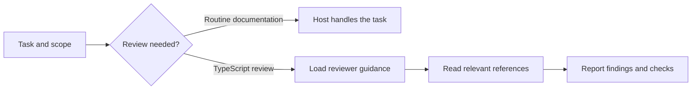

<p align="center">
  
</p>

<p align="center">
  <a href="https://www.npmjs.com/package/@fibilisim/leanagents"></a>
  <a href="https://github.com/Fibilisim-Tekno/leanagents/actions/workflows/ci.yml"></a>
  <a href="#quick-start"></a>
  <a href="LICENSE"></a>
  <a href="#project-status"></a>
</p>

<p align="center">
  <a href="#quick-start">Quick start</a> ·
  <a href="#how-it-works">How it works</a> ·
  <a href="#editor-support">Editor support</a> ·
  <a href="#verification-and-evidence">Evidence</a> ·
  <a href="#documentation">Documentation</a>
</p>

# The right guidance for the task at hand

LeanAgents brings selective instructions and bounded TypeScript review workflows to AI coding assistants. A small routing rule stays available; the host reads reviewer guidance and references when the task calls for them.

Start with one focused reviewer, explicit context budgets, and recorded verification. Keep routine work with your coding assistant, then add review where it matters.

| Focused context | Bounded review | Traceable changes |
| --- | --- | --- |
| Keep the routing rule small. Load the reviewer and references when relevant. | The fix runner uses one implementation call and at most one separate reviewer call. | Record source hashes, candidate tests, review results and model usage before applying a fix. |

## Quick start

**Requires Node.js 22.12 or later.** Run inside the project where you want to use LeanAgents:

```bash
npx @fibilisim/leanagents setup --target codex
```

No repository clone or build is needed. To choose an editor interactively:

```bash
npx @fibilisim/leanagents setup
```

<details>
<summary><strong>Kiro, Cursor and Antigravity</strong></summary>

Run the command for your editor:

```bash
npx @fibilisim/leanagents setup --target kiro
npx @fibilisim/leanagents setup --target cursor
npx @fibilisim/leanagents setup --target antigravity
```

Antigravity receives an explicit Always On rule. Kiro receives an always-included steering file; Cursor receives an always-applied project rule.

</details>

<details>
<summary><strong>Preview changes or install into another project</strong></summary>

```bash
npx @fibilisim/leanagents setup --target codex --dry-run
npx @fibilisim/leanagents setup --target codex --dir ./my-project
```

The project directory must already exist. Setup appends a marked block to existing Codex instructions and creates a backup. Conflicting instruction files stop setup during preflight; repeating an unchanged installation adds no duplicates. An existing `AGENTS.override.md` requires manual integration because it takes precedence.

</details>

**After setup:** start a new assistant session in that project and work normally. The installed rule guides task selection; it does not automatically run the CLI fix pipeline or enforce the assistant's behavior.

For example, ask your assistant:

> Review the TypeScript changes in this project. Follow its LeanAgents instructions, report actionable defects, and run the relevant tests.

## How it works



The editor rule keeps documentation-only work on the host and requests at most one reviewer for TypeScript review. Longer references remain separate from the initial instructions. Native delegation depends on the host; a host review must not be described as independent.

For explicit automation, the CLI offers a separate bounded workflow:

**Snapshot → candidate → supplied tests → separate review → guarded apply**

The `fix` command leaves original source files untouched. The separate `apply` command rechecks source hashes, candidate contents, tests and the approving review before replacing selected files.

## Editor support

Installation support and native execution are tracked separately.

| Editor | Installed project rule | Activation | Verification |
| --- | --- | --- | --- |
| **Codex** | `AGENTS.md` | Project instructions | Real CLI bootstrap loading; snapshot review and fix smoke tests |
| **Kiro** | `.kiro/steering/leanagents.md` | `inclusion: always` | Generated format and installation tested |
| **Cursor** | `.cursor/rules/leanagents.mdc` | `alwaysApply: true` | Generated format and installation tested |
| **Antigravity** | `.agents/rules/leanagents.md` | `trigger: always_on` | Installation tested; installed rule-editor parser inspected |

Native agent execution in Kiro, Cursor and Antigravity remains unverified. These adapters install instructions, not registered native subagents. See [adapter behavior, activation and upgrades](docs/ADAPTERS.md).

## What is included

| Component | Purpose |
| --- | --- |
| **TypeScript reviewer** | Focus review on actionable defects with evidence and relevant references. |
| **Task routing** | Build a selection plan from explicit task scope, risk and behavior changes. |
| **Context preparation** | Assemble selected guidance with a manifest, hashes and local token counts. |
| **Bounded fix runner** | Propose edits to selected existing TypeScript files, run supplied tests and request a separate review. |
| **Guarded application** | Reject stale originals or changed candidates before applying verified edits. |
| **Catalog checks** | Validate instruction structure and enforce configured size budgets. |
| **Evaluation tools** | List fixtures, score recorded outputs and report results. |

### Command reference

Run `npx @fibilisim/leanagents <command> --help` for options.

| Command | Use |
| --- | --- |
| `setup` | Install instructions into an existing project. |
| `export` | Create a standalone instruction bundle in a new directory. |
| `route` / `prepare` | Select guidance and assemble a task packet. |
| `review` | Review explicit source snapshots through the authenticated Codex CLI. |
| `fix` / `apply` | Generate and verify a candidate, then apply it separately. |
| `validate` / `measure` / `check` | Inspect the catalog, measure instructions and check budgets. |
| `bench list` / `bench score` / `bench report` | Work with evaluation fixtures and recorded outputs. |

Setup, exports and catalog commands do not call a model. `review` and `fix` use an installed, authenticated Codex CLI and consume that account's model quota.

<details>
<summary><strong>Try the included bounded-fix example</strong></summary>

Clone and build the project to access the sample files:

```bash
git clone https://github.com/Fibilisim-Tekno/leanagents.git
cd leanagents
npm ci
npm run build
```

Use a model ID available to your authenticated Codex account:

```bash
node dist/bin.js fix --repo examples/batch-fix --spec examples/batch-fix/task.json --out ../leanagents-run --model YOUR_MODEL_ID
node dist/bin.js apply --repo examples/batch-fix --run ../leanagents-run
```

The sample intentionally contains a defect. Inspect the run artifacts before applying; `apply` changes the sample source. The run directory must not already exist. On Windows, use `--codex-js` when the installed Codex launcher is a shell shim.

See [the bounded-fix guide](docs/FIX-WORKFLOW.md) for supported inputs, verification gates and failure behavior.

</details>

## Verification and evidence

The current alpha has **173 passing tests**, with type checking, lint and build checks. CI covers **Windows and Ubuntu on Node.js 22 and 24**; the live CI badge reports the current branch status.

| Evidence | What it demonstrates |
| --- | --- |
| [Reviewer smoke test](bench/SNAPSHOT-SMOKE-2026-09-14.md) | A known TypeScript defect was reported; the corrected sample produced no finding. |
| [Bounded-fix smoke test](bench/FIX-SMOKE-2026-09-14.md) | A constructed example went from two failing tests to 3/3 passing, followed by review and guarded apply. |
| [Instruction-only pilot](bench/PILOT-2026-09-14.md) | An initial three-arm prompt comparison with documented limitations. |
| [Evaluation methodology](bench/METHODOLOGY.md) | Comparison rules for task selection, scoring and usage accounting. |

**Measurement policy:** catalog tokens, assembled prompt tokens and actual model usage are different quantities. Smaller instruction files alone do not prove lower total cost. Current evidence does not establish general quality or performance superiority over other toolkits.

## Project status

**Active alpha.** The first specialist is a TypeScript reviewer. Routing, context preparation, editor setup, snapshot review and bounded fixes are implemented. Additional specialists will be added when evaluation demonstrates a concrete need.

The current fix runner accepts explicit, dependency-free TypeScript snapshots and supplied Node tests. It does not install dependencies, generate tests, or perform general autonomous repository editing. Tests execute locally with the user's access; a candidate working directory is not an operating-system sandbox. Passing tests and review provide evidence for the checked behavior, not a guarantee of correctness.

### Next milestones

- Validate native workflows and context loading in Kiro, Cursor and Antigravity.
- Evaluate held-out tasks under comparable model and tool settings.
- Expand language and specialist coverage where measured failures justify it.
- Improve upgrades, recovery and release automation.

## Documentation

| Guide | Contents |
| --- | --- |
| [Editor adapters](docs/ADAPTERS.md) | Generated files, activation, runtime verification and upgrades |
| [Bounded fixes](docs/FIX-WORKFLOW.md) | Input requirements, execution limits and apply safeguards |
| [Evaluation methodology](bench/METHODOLOGY.md) | Benchmark design and scoring |
| [Changelog](CHANGELOG.md) | Release history |
| [Contributing](CONTRIBUTING.md) | Development setup and contribution expectations |
| [Security policy](SECURITY.md) | Reporting vulnerabilities privately |

## Contributing

Reproducible defects, focused fixes, native editor validation and held-out evaluation cases are welcome. Start with the [contribution guide](CONTRIBUTING.md) or [open an issue](https://github.com/Fibilisim-Tekno/leanagents/issues).

For local development, use Node.js 22.13 or later, or Node.js 24:

```bash
npm ci
npm run check:all
npm run build
node dist/bin.js check
```

---

<p align="center">
  Maintained by <a href="https://github.com/Fibilisim-Tekno">Fibilisim Tekno</a> ·
  <a href="LICENSE">MIT License</a> ·
  <a href="https://www.npmjs.com/package/@fibilisim/leanagents">npm</a> ·
  <a href="https://github.com/Fibilisim-Tekno/leanagents/issues">Issues</a>
</p>
